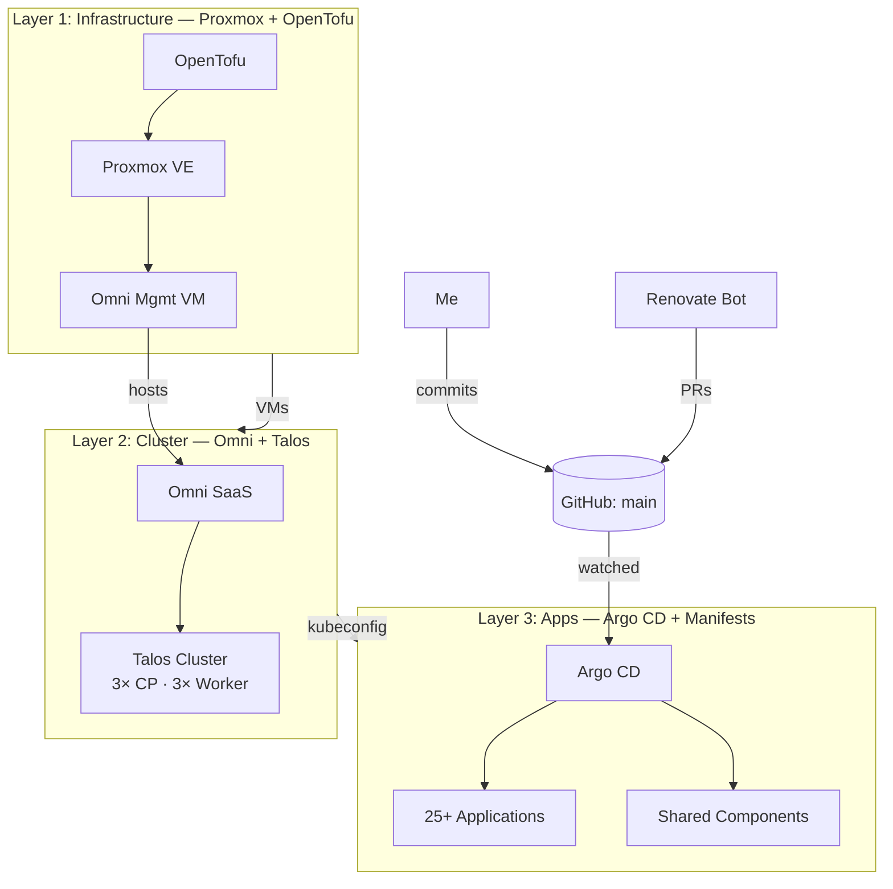

<div align="center">


&nbsp;

&nbsp;

&nbsp;

&nbsp;


# homelab

_Three independent layers — infrastructure, cluster, apps — that compose into a full stack._

</div>

**Cluster**
&nbsp;
[](https://talos.dev)
[](https://kubernetes.io)
[](https://github.com/kashalls/kromgo)
[](https://github.com/kashalls/kromgo)
[](https://github.com/kashalls/kromgo)

**Repo**
&nbsp;
[](./LICENSE)
[](https://github.com/alexander-zimmermann/homelab/commits/main)
[](https://docs.renovatebot.com/)
[](https://argo-cd.readthedocs.io/)
[](https://omni.siderolabs.com/)

---

## About

This is my personal homelab — a single [Proxmox VE](https://www.proxmox.com/) box tucked under the desk, running a [Talos Linux](https://www.talos.dev/) Kubernetes cluster that hosts everything from Grafana and Authentik down to the service that scrapes my solar inverter. It's my playground, my production, and the place where I try things before I recommend them to colleagues.

What I care about most is that **everything is declarative end-to-end.** A git push is the only way state reaches the cluster. There is no `kubectl apply`, no `tofu apply` at 2 a.m. from my laptop, no snowflake tweaks. [Renovate](https://docs.renovatebot.com/) opens PRs when new versions drop, I merge them, [Argo CD](https://argo-cd.readthedocs.io/) rolls them out. It's boring. Boring is the point.

The part I'm most proud of is how the repo is **split into three independent layers** — `infrastructure/`, `cluster/`, `kubernetes/`. Each one solves a single problem, speaks a single tool's language, and could be lifted out and reused in isolation. Together they form the stack; apart they're still useful on their own.

## The three layers

### 🧱 Layer 1 — `infrastructure/` · Proxmox IaC

[](https://opentofu.org/)
[](https://www.proxmox.com/)

[OpenTofu](https://opentofu.org/) with the [`bpg/proxmox`](https://github.com/bpg/terraform-provider-proxmox) provider, driven by split YAML manifests. Manages the Proxmox cluster settings, node config, OS images, templates, and the entire VM/LXC fleet — including Windows 11 VMs with TPM/Secure Boot and a dedicated management VM that hosts Omni.

**This layer has nothing to do with Kubernetes.** I could throw away everything above it and still have a clean, reproducible "Proxmox managed by code" setup.

**Swap-out**: any IaC for any hypervisor. Replace `bpg/proxmox` with `libvirt`, `vsphere`, or a cloud provider and rewrite the `pve_*` modules. The manifest structure and cloud-init plumbing stay.

→ [Full docs](infrastructure/README.md)

### 🚀 Layer 2 — `cluster/` · Omni + Talos

[](https://www.talos.dev/)
[](https://omni.siderolabs.com/)

Three YAML files describe the cluster: versions, machine shapes, system extensions. [Omni](https://omni.siderolabs.com/) does the rest — hands out Talos configs, bootstraps etcd, rotates certificates, tunnels the API server past my dynamic IP.

Machine classes ([`homelab-machine-classes.yaml`](cluster/homelab-machine-classes.yaml)) are auto-provisioned: **3× control plane** (4 vCPU, 4 GB) and **3× worker** (6 vCPU, 10 GB, extra storage disk). Omni picks fresh VMs, assigns roles, done.

**Swap-out**: Omni supports [many infrastructure providers](https://docs.siderolabs.com/omni/infrastructure-and-extensions/infrastructure-providers) — libvirt, vSphere, AWS, Hetzner, bare-metal PXE. Only two fields (`providerid`, `providerdata`) are Proxmox-specific.

→ [Full docs](cluster/README.md)

### ☸️ Layer 3 — `kubernetes/` · Argo CD + Manifests

[](https://argo-cd.readthedocs.io/)
[](https://kustomize.io/)

Standard CNCF Kubernetes manifests, grouped into `bootstrap/` (day-zero), `components/` (shared infra — ingress, cert-manager, CSI, sealed-secrets, …), and `applications/` (25+ end-user apps). Two Argo CD `ApplicationSet`s auto-discover new folders by convention; I never hand-write an `Application` resource.

**Swap-out**: this tree is vanilla Kubernetes. Strip the `talos-ccm` bootstrap folder and it runs on k3s, kind, EKS, whatever. No Talos lock-in above the control-plane layer.

→ [Full docs](kubernetes/README.md)

> **Why I like this split:** each layer has exactly one job, exactly one tool, and a clean escape hatch. If tomorrow I fall out of love with Proxmox, I rewrite one layer. If I want to move off Omni, I rewrite another. Nothing cascades.

## Architecture



## Hardware

### Compute

| Component  | Spec                                                           |
| ---------- | -------------------------------------------------------------- |
| Chassis    | Lenovo ThinkStation P3 Tiny Gen 2                              |
| CPU        | Intel® Core™ Ultra 5 235T vPro® (14 cores, Arrow Lake-S, 35 W) |
| Memory     | 64 GB DDR5-6400 (2× Kingston ValueRAM 32 GB)                   |
| Storage    | 1 TB WD Black SN8100 NVMe (ZFS, `local-zfs`)                   |
| Hypervisor | Proxmox VE 9                                                   |

### Talos VMs

Six VMs on the one Proxmox host, auto-provisioned by Omni — see [`cluster/homelab-machine-classes.yaml`](cluster/homelab-machine-classes.yaml).

| Role          | Count | vCPU | RAM   | Root  | Extra disks                    |
| ------------- | ----- | ---- | ----- | ----- | ------------------------------ |
| Control plane | 3     | 4    | 4 GB  | 32 GB | —                              |
| Worker        | 3     | 6    | 10 GB | 64 GB | 128 GB (storage) + 4 GB (swap) |

### Network

All-Ubiquiti stack — one uplink per tier, 10 GbE between switches, PoE on the edge.

| Device                                                    | Role                                                 |
| --------------------------------------------------------- | ---------------------------------------------------- |
| EDPNET Belgium                                            | ISP (WAN)                                            |
| [UDM-Pro](https://ui.com/cloud-gateways/udm-pro)          | Gateway / firewall / Network controller              |
| [USW Pro HD 24](https://ui.com/switching/usw-pro-hd-24)   | Core switch (10 GbE uplink to UDM-Pro)               |
| [USW Pro Max 48](https://ui.com/switching/usw-pro-max-48) | Aggregation switch (10 GbE uplink to USW Pro HD 24)  |
| [USW Pro 48 PoE](https://ui.com/switching/usw-pro-48-poe) | Access switch (10 GbE uplink, PoE for APs & cameras) |
| [USP-RPS](https://ui.com/power-backup/usp-rps)            | Redundant power supply for the rack                  |
| 2× [U7 Pro](https://ui.com/wifi/flagship/u7-pro)          | Wi-Fi 7 APs (1× floor)                               |
| 3× [U6-LR](https://ui.com/wifi/long-range/u6-long-range)  | Wi-Fi 6 long-range APs (ground floor + basement)     |

### Storage (shared)

| Device                                      | Role                                                                  |
| ------------------------------------------- | --------------------------------------------------------------------- |
| [UNAS Pro](https://ui.com/storage/unas-pro) | 4-bay NAS — bulk storage, backups, S3 targets for PITR/object storage |

## Highlights

A quick taste of what's running — full catalog in [`kubernetes/README.md`](kubernetes/README.md#catalog):

- **GitOps everywhere** — [Argo CD](https://argo-cd.readthedocs.io/) reconciles the cluster, [Renovate](https://docs.renovatebot.com/) opens PRs for every dependency bump.
- **Immutable OS** — [Talos Linux](https://www.talos.dev/) with disk encryption, managed by [Omni](https://omni.siderolabs.com/).
- **Identity & edge** — [Authentik](https://goauthentik.io/) SSO/forward-auth, [Traefik](https://traefik.io/) with pre/post-auth middleware chains, [CrowdSec](https://www.crowdsec.net/) behavior-based IPS, [Cloudflare](https://www.cloudflare.com/) WAF.
- **Data plane** — [CloudNativePG](https://cloudnative-pg.io/) with Barman S3 PITR backups, [Redis](https://redis.io/), [NATS](https://nats.io/), [InfluxDB](https://www.influxdata.com/), [RustFS](https://github.com/rustfs/rustfs) for S3-compatible object storage.
- **Observability** — [Prometheus](https://prometheus.io/), [Grafana](https://grafana.com/), [Loki](https://grafana.com/oss/loki/), [Alloy](https://grafana.com/docs/alloy/), [Gatus](https://gatus.io/), plus [kromgo](https://github.com/kashalls/kromgo) powering the badges above.

## Repository structure

```
homelab/
├── infrastructure/   # Layer 1 — Proxmox IaC (OpenTofu + bpg/proxmox)
├── cluster/          # Layer 2 — Omni cluster templates + machine classes
├── kubernetes/       # Layer 3 — Argo CD-reconciled manifests
│
├── tasks/            # Taskfile includes (cluster/, infra/, kubernetes/)
└── Taskfile.yaml     # Top-level entry point — `task --list`
```

Each of the three layer directories has its own detailed README:

- [**infrastructure/README.md**](infrastructure/README.md)
- [**cluster/README.md**](cluster/README.md)
- [**kubernetes/README.md**](kubernetes/README.md)

## Acknowledgements

Standing on the shoulders of giants. This setup borrows patterns and inspiration from:

- [buroa/k8s-gitops](https://github.com/buroa/k8s-gitops) — the kromgo badge idea and a lot of stylistic cues.
- The [home-operations](https://github.com/home-operations) community.

## License

See [LICENSE](LICENSE).
