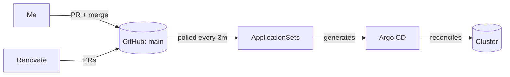

# Kubernetes — Argo CD + Manifests

[](https://argo-cd.readthedocs.io/)
[](https://kustomize.io/)
[](https://github.com/bitnami-labs/sealed-secrets)

> **Layer 3 of [the homelab stack](../README.md).** Standard CNCF-compatible Kubernetes manifests, reconciled by Argo CD. Nothing Talos- or Proxmox-specific lives in here (except a tiny `talos-ccm` bootstrap bit). Drop this directory into k3s, kind, EKS, or whatever — it'll work.

## What this directory does

Argo CD watches `main` and syncs everything under here into the cluster. I never `kubectl apply` anything by hand — a push to `main` is the only way state changes.

Two `ApplicationSet`s (defined in [`bootstrap/gitops-controller/base/`](bootstrap/gitops-controller/base/)) auto-generate Argo `Application`s by scanning directory conventions:

- One scans `components/*/base/kustomization.yaml` → shared infra
- One scans `applications/*/base/kustomization.yaml` → end-user apps

Add a folder that matches the convention and Argo picks it up on the next reconcile. No manual `Application` wiring per app.

## Directory layout

```
kubernetes/
├── bootstrap/          # Day-zero manifests (applied before Argo takes over)
│   ├── cilium/         #   eBPF CNI (kube-proxy replacement, L2 announcements)
│   ├── gitops-controller/  # Argo CD itself + the ApplicationSets that drive everything else
│   └── talos-ccm/      #   Talos cloud-controller-manager (node provider integration)
│
├── components/         # Shared infra used by many apps
│   ├── admission-controller/   # Kyverno (secret replication, admission policies)
│   ├── cert-manager/           # TLS via Cloudflare DNS-01
│   ├── cilium/                 # Cilium CRDs + overlays
│   ├── csi-block-storage-controller/
│   ├── csi-nfs-controller/
│   ├── external-dns/           # Syncs ingress hostnames → Cloudflare
│   ├── gitops-controller/      # Argo CD overlays
│   ├── ingress-controller/     # Traefik + middleware chains (pre/post-auth)
│   ├── metrics-server/
│   ├── prometheus-crds/
│   ├── sealed-secrets-controller/
│   └── talos-ccm/
│
└── applications/       # End-user apps (each with base/ + overlays/{dev,prod})
    ├── authentik/      #   SSO / OIDC
    ├── grafana/        #   Dashboards
    ├── homepage/       #   Service start page
    ├── kromgo/         #   Cluster-stats badges (see top-level README)
    ├── prometheus/     #   Metrics & alerting
    ├── loki/           #   Logs
    ├── cloudnative-pg/ #   Postgres operator
    ├── crowdsec/       #   IPS
    ├── wiki-js/        #   Personal wiki
    └── …               #   (25+ in total)
```

## GitOps flow



Secrets are encrypted with [Sealed Secrets](https://github.com/bitnami-labs/sealed-secrets) — the master key lives in `components/sealed-secrets-controller/base/master-key.yaml` and is **not** in git (it's seeded once per cluster via `task k8s:init`). Every `secret.yaml` in the tree has a matching `sealed-secret.yaml` that Argo applies; the controller decrypts it in-cluster.

## Usage

From the repo root (uses [go-task](https://taskfile.dev)):

| Task                                         | What it does                                                                                                |
| -------------------------------------------- | ----------------------------------------------------------------------------------------------------------- |
| `task k8s:init`                              | Bootstrap sealed-secrets master key + DHI registry credentials. Run once, right after the cluster comes up. |
| `task k8s:status`                            | Show nodes, pods (all namespaces), and Cilium status.                                                       |
| `task k8s:show`                              | Print the Argo CD admin password.                                                                           |
| `task k8s:seal path/to/secret.yaml`          | Encrypt a plain secret for git. Writes `sealed-secret.yaml` next to it.                                     |
| `task k8s:unseal path/to/sealed-secret.yaml` | Decrypt back to `secret.yaml` (needs local master key).                                                     |
| `task k8s:delete`                            | **Wipe every managed namespace** (prompted). Useful before re-bootstrapping.                                |

## Adding a new app

1. `mkdir -p kubernetes/applications/<name>/base` and drop your manifests in.
2. Create `base/kustomization.yaml` with `namespace: <name>` and list the resources.
3. Create `overlays/{dev,prod}/kustomization.yaml` that reference `../../base` and apply env-specific patches (hostnames, replicas).
4. Commit, push. The `applications` ApplicationSet picks it up within one sync interval.

If your app needs secrets: write them as plain `secret.yaml`, then `task k8s:seal kubernetes/applications/<name>/base/secret.yaml`, commit only the `sealed-secret.yaml`.

## Catalog

All components grouped by what they do. Icons via [homarr-labs/dashboard-icons](https://github.com/homarr-labs/dashboard-icons), served through jsDelivr. Rows without an icon are for projects that don't have a curated brand-icon (yet).

### Platform

|                                                                                                        | Component                                                        | Purpose                                                           |
| ------------------------------------------------------------------------------------------------------ | ---------------------------------------------------------------- | ----------------------------------------------------------------- |
|         | [Talos Linux](https://www.talos.dev/)                            | Immutable, API-managed Kubernetes OS                              |
|                                                                                                        | [Omni](https://omni.siderolabs.com/)                             | SaaS control plane for Talos (auto-provisioning, machine classes) |
|        | [Cilium](https://cilium.io/)                                     | eBPF CNI (kube-proxy replacement, L2 announcements)               |
|       | [Traefik](https://traefik.io/)                                   | Ingress with pre/post-auth middleware chains                      |
|  | [cert-manager](https://cert-manager.io/)                         | Automated TLS via Cloudflare DNS-01                               |
|                                                                                                        | [external-dns](https://github.com/kubernetes-sigs/external-dns)  | Syncs ingress hostnames to Cloudflare                             |
|                                                                                                        | [Kyverno](https://kyverno.io/)                                   | Policy engine (secret replication, admission)                     |
|                                                                                                        | [Sealed Secrets](https://github.com/bitnami-labs/sealed-secrets) | Git-safe, cluster-decryptable secrets                             |

### GitOps & Automation

|                                                                                                    | Component                                  | Purpose                                       |
| -------------------------------------------------------------------------------------------------- | ------------------------------------------ | --------------------------------------------- |
|   | [Argo CD](https://argo-cd.readthedocs.io/) | Declarative sync of `kubernetes/applications` |
|  | [Renovate](https://docs.renovatebot.com/)  | Automated dependency PRs                      |

### Security & Identity

|                                                                                                      | Component                                 | Purpose                                 |
| ---------------------------------------------------------------------------------------------------- | ----------------------------------------- | --------------------------------------- |
|   | [Authentik](https://goauthentik.io/)      | SSO / OIDC / forward-auth               |
|    | [CrowdSec](https://www.crowdsec.net/)     | Behavior-based IPS on ingress           |
|  | [Cloudflare](https://www.cloudflare.com/) | WAF, rate-limiting, edge TLS, tunneling |

### Storage & Data

|                                                                                                      | Component                                                                     | Purpose                                |
| ---------------------------------------------------------------------------------------------------- | ----------------------------------------------------------------------------- | -------------------------------------- |
|  | CSI Block + NFS                                                               | Persistent volumes for workloads       |
|                                                                                                      | [RustFS](https://github.com/rustfs/rustfs)                                    | S3-compatible object storage           |
|  | [CloudNativePG](https://cloudnative-pg.io/) + [Barman](https://pgbarman.org/) | Postgres operator with S3 PITR backups |
|       | [Redis](https://redis.io/)                                                    | In-memory cache                        |
|                                                                                                      | [NATS](https://nats.io/)                                                      | Lightweight messaging                  |
|    | [InfluxDB](https://www.influxdata.com/)                                       | Time-series DB for IoT telemetry       |

### Observability

|                                                                                                      | Component                                    | Purpose                                     |
| ---------------------------------------------------------------------------------------------------- | -------------------------------------------- | ------------------------------------------- |
|  | [Prometheus](https://prometheus.io/)         | Metrics & alerting                          |
|     | [Grafana](https://grafana.com/) + Operator   | Dashboards, dashboards-as-code              |
|        | [Loki](https://grafana.com/oss/loki/)        | Log aggregation                             |
|       | [Alloy](https://grafana.com/docs/alloy/)     | Unified telemetry collector                 |
|       | [Gatus](https://gatus.io/)                   | Status page / synthetic probes              |
|                                                                                                      | [kromgo](https://github.com/kashalls/kromgo) | PromQL → shields.io bridge (cluster badges) |

### Applications

|                                                                                                    | Component                            | Purpose                                   |
| -------------------------------------------------------------------------------------------------- | ------------------------------------ | ----------------------------------------- |
|                                                                                                    | [Homepage](https://gethomepage.dev/) | Service start page                        |
|    | [Wiki.js](https://js.wiki/)          | Knowledge base                            |
|  | [Node-RED](https://nodered.org/)     | Flow-based automation                     |
|                                                                                                    | SolarEdge2MQTT                       | PV inverter → MQTT / InfluxDB             |
|                                                                                                    | SMTPRelay                            | Outbound mail relay for cluster workloads |

## Portability note

The whole `kubernetes/` tree is standard CNCF Kubernetes. Point a k3s or kind cluster at it and it'll largely just run — the only real Talos-isms are:

- `bootstrap/talos-ccm/` — only makes sense on Talos; strip it on other distros.
- A handful of `securityContext` tweaks tuned for Talos's strict defaults.
- `storageClass` names assuming the Talos CSI drivers.

Everything else (ingress, certs, DNS, Argo CD, all 25+ apps) is portable.

## Bootstrap sequence

### With Omni (this repo's default)

Omni applies Cilium, Argo CD, and Talos-CCM automatically via [`extraManifests`](../cluster/patches/extraManifests-prod.yaml) during cluster creation — see [Layer 2 (cluster)](../cluster/README.md#bootstrap-sequence). The rendered manifests are continuously published to the [`bootstrap` branch](https://github.com/alexander-zimmermann/homelab/tree/bootstrap) by the [`cd-render-bootstrap.yaml`](../.github/workflows/cd-render-bootstrap.yaml) workflow — that's what Omni pulls.

So once the cluster is up and `kubeconfig` is on your machine, there's only one step left:

1. `task k8s:init` — seeds the sealed-secrets master key + DHI registry credentials.

That's it. Argo CD is already running and starts reconciling the components / applications trees.

### Without Omni (plain Kubernetes)

If you're running this tree on a different cluster without Omni's `extraManifests` mechanism, apply the bootstrap manifests yourself:

1. `kubectl apply -k kubernetes/bootstrap/cilium/overlays/prod` — CNI online.
2. `kubectl apply -k kubernetes/bootstrap/talos-ccm/overlays/prod` — nodes get proper labels. _(Skip on non-Talos clusters.)_
3. `kubectl apply -k kubernetes/bootstrap/gitops-controller/overlays/prod` — Argo CD + the two ApplicationSets land, reconciliation starts.
4. `task k8s:init` — seed the sealed-secrets master key + DHI registry credentials.

## License

See [../LICENSE](../LICENSE).
